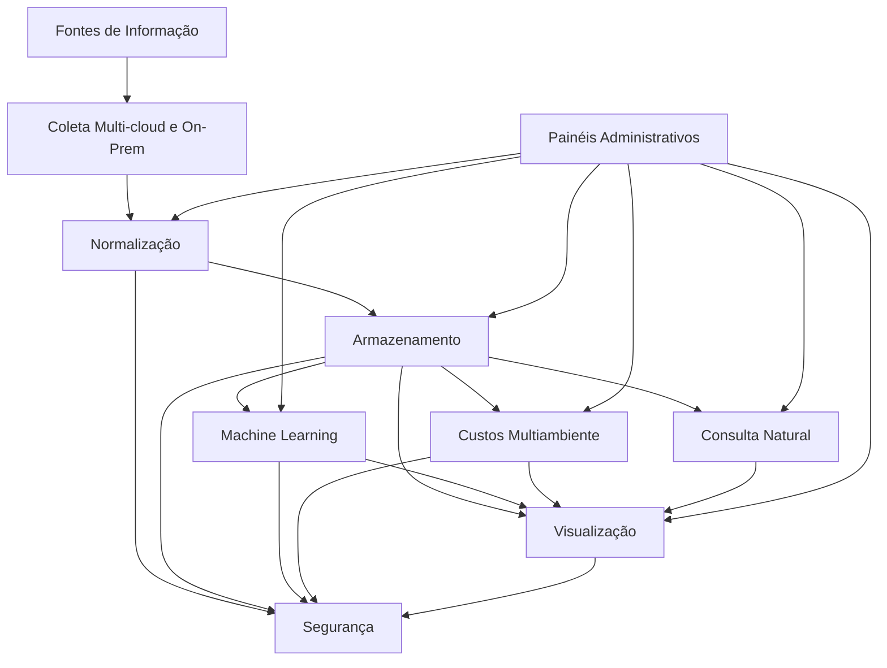

# ThriftData

## Visão Geral

ThriftData é uma stack modular para coleta, análise e visualização de dados operacionais e financeiros em ambientes multi-cloud e on-prem. Foco em FinOps, observabilidade e governança, integrando automação, machine learning e consulta natural com LLMs.

Esta arquitetura foi idealizada para prover uma solução robusta, escalável e flexível de coleta, normalização, armazenamento, análise e visualização de dados em ambientes híbridos multi-cloud e on-premises, com suporte integrado a Machine Learning, FinOps, segurança e consultas naturais (NLQ). A escolha da stack reflete as melhores práticas e ferramentas open source consolidadas no mercado, garantindo interoperabilidade, controle, custo-efetividade e inovação contínua.

## Justificativas para a Stack

### Fontes de Informação

Diversidade e abrangência são essenciais para capturar dados relevantes:
- Sistemas administrativos e ERP fornecem informações críticas de negócio.
- Logs, métricas e dados financeiros capturam o estado operacional e econômico.
- Métricas de workloads (Kubernetes, VMs, containers) refletem a utilização real dos recursos.
- Dados de orquestração e pipelines CI/CD trazem visibilidade sobre automação e entrega contínua.
- Logs de segurança e compliance asseguram governança e conformidade.

### Coleta Multi-cloud e On-Premises

- **OpenTelemetry:** padrão aberto, facilita coleta unificada e interoperável de métricas, logs e traces.
- **Steampipe e CloudQuery:** acessam APIs de diversas fontes para dados adicionais como billing e inventário.
- **Cloud Custodian:** permite automação e políticas de governança em múltiplos ambientes.

### Normalização e Orquestração

- **Apache Airflow e n8n:** orquestração flexível dos processos ETL, integração com múltiplas fontes e ferramentas.
- **dbt:** foco em transformação modular, versionada e testada, usando modelos de dados alinhados com negócios.

### Armazenamento

- Uso combinado de Data Lakes (escaláveis e econômicos), Graph DBs (para relacionamentos complexos) e bancos relacionais tradicionais, garantindo flexibilidade e desempenho.

### Machine Learning

- **Kubeflow e MLFlow:** suporte completo para ciclos de vida de modelos ML, desde treino até deployment e monitoramento.
- Permite identificar anomalias, prever tendências e automatizar decisões.

### FinOps e Monitoramento de Custos

- Ferramentas como **Kubecost** e dashboards customizados permitem controle detalhado de custos em Kubernetes e multi-cloud, viabilizando otimização financeira e tomada de decisão baseada em dados.

### Visualização e NLQ

- Plataformas de visualização como **Superset**, **Metabase** e **Grafana** oferecem dashboards ricos e alertas configuráveis.
- **LangChain e LlamaIndex** incorporam consultas naturais e geração de relatórios dinâmicos baseados em IA, facilitando acesso intuitivo à informação.

### Segurança

- **HashiCorp Vault:** gerenciamento seguro de segredos, reduz riscos de exposição.
- **MinIO:** armazenamento seguro, compatível com S3, criptografia e alta disponibilidade.

### Administração

- **React Admin:** framework para painéis administrativos customizados, facilitando controle de acessos, configurações e governança centralizada.

### Arquitetura da solução

https://www.mermaidchart.com/app/projects/8e5b2941-2da3-4e1c-82bc-d083720921ed/diagrams/9899d941-c9c9-4c6b-b4ba-e72ee08fcbe7/version/v0.1/edit

---

## Benefícios da Stack

- **Escalabilidade e flexibilidade:** apta para crescimento e mudanças sem bloqueios tecnológicos.
- **Open Source e padrões abertos:** evita vendor lock-in, facilita integração e customização.
- **Cobertura abrangente:** do monitoramento à visualização, passando por ML, FinOps e segurança.
- **Custo-benefício:** uso racionalizado de recursos e ferramentas maduras.
- **Suporte à inovação:** incorpora recursos avançados como NLQ e IA.

---

## Conclusão

Esta stack é uma base estratégica para empresas que buscam governança inteligente de ambientes híbridos e multi-cloud, alinhando tecnologia de ponta, segurança, eficiência operacional e experiência do usuário. Ela oferece um ecossistema integrado, capaz de suportar desde operações críticas até análises avançadas, facilitando decisões embasadas e ágeis.

---

WIP
